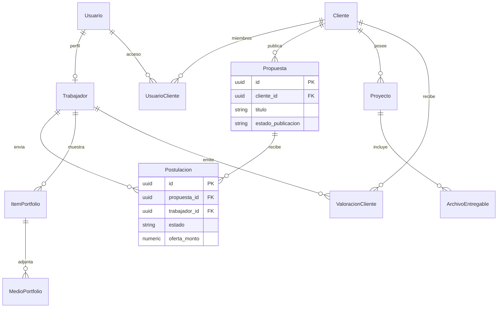

# Plan: MER, modelo relacional y SQL para Gestión de Estudios

## Alcance y supuestos

- **Dominio** tomado de [README.md](c:\Users\Usuario\Desktop\trabajo\GestionDeEstudios\README.md): usuarios con cuenta genérica; permisos para operar en modo **Cliente** y/o **Trabajador**; proyectos por **cliente (marca)**; **archivos entregables** (muestra / final) según reglas de negocio.
- **Ampliación acordada (prioritaria en el modelo):**
  - Una **propuesta** la crea/publica un **cliente** y **muchos trabajadores** pueden **postular** (aplicar) a ella. La relación cliente–propuesta es **1:N**; propuesta–trabajador es **N:M** resuelta por una entidad asociativa **Postulación** (con estados: p. ej. enviada, preseleccionada, aceptada, rechazada, retirada).
  - Cada **trabajador** dispone en su panel de un apartado **portfolio**: puede ir cargando **ítems de portfolio** (proyectos de muestra: título, descripción, orden) y **medios/archivos** asociados a cada ítem (imágenes, enlaces, etc.).
  - Cada **cliente** debe tener una **calificación** visible: en el MER conviene separar **valoraciones** (historial, quién valora, cuándo) de un **promedio** mostrable (columna desnormalizada en `cliente` o vista materializada / cálculo en app).
- **Coherencia con el README antiguo:** el README hablaba de “propuesta/presupuesto” como documento económico enviado por el estudio. En este diseño, **“Propuesta”** se alinea con la **convocatoria/solicitud publicada por el cliente**; el detalle económico puede vivir en la **postulación** (oferta del trabajador) y/o en una tabla **presupuesto** ligada al proyecto una vez asignado el trabajador. Documentar en el diccionario de datos esa convención de nombres para no mezclar conceptos.
- **Supuesto de negocio:** un solo estudio / marketplace unificado (multi-tenant “varios estudios” como plataformas separadas queda fuera de v1 salvo que lo pidas después).
- **Motor recomendado:** **PostgreSQL** (tipos `ENUM` o `CHECK`, integridad referencial sólida). El MR y el SQL se pueden adaptar a MySQL 8+ con cambios menores (tipos y sintaxis de índices).

---

## Fase 1 — MER (Modelo Entidad-Relación)

**Objetivo:** diagrama y diccionario de entidades, atributos y cardinalidades.

**Entidades principales:**

| Entidad                                        | Rol                                                                                                                                                                                                                                                                                               |
| ---------------------------------------------- | ------------------------------------------------------------------------------------------------------------------------------------------------------------------------------------------------------------------------------------------------------------------------------------------------- |
| `Usuario`                                      | Cuenta de acceso (email, credencial); no “tipo fijo” en el registro.                                                                                                                                                                                                                              |
| `Cliente`                                      | Marca / organización contratante; agrupa proyectos; **tiene calificación** (promedio y/o conjunto de valoraciones).                                                                                                                                                                               |
| `UsuarioCliente`                               | Asociación **Usuario ↔ Cliente** para modo Cliente. **N:M** típico.                                                                                                                                                                                                                               |
| `Trabajador`                                   | Perfil profesional ligado a un `Usuario` (1:1); quien postula y gestiona portfolio. Si se prefiere mínimo de tablas: mismo `Usuario` con `puede_trabajador` y FK implícito; el MER recomienda entidad **Trabajador** para atributos de perfil (bio, disponibilidad, etc.).                        |
| `PermisoModo`                                  | Puede operar en modo Cliente y/o Trabajador (atributos o tabla).                                                                                                                                                                                                                                  |
| `Propuesta`                                    | **Convocatoria** publicada por un **Cliente** (título, descripción, requisitos, presupuesto estimado opcional, fechas, estado: borrador, publicada, cerrada, asignada…). **1 cliente : N propuestas**.                                                                                            |
| `Postulacion`                                  | Un **Trabajador** postula a una **Propuesta**; atributos: carta/mensaje, oferta económica opcional, estado de la postulación, fechas. **Restricción:** como mucho una postulación activa por par (propuesta, trabajador) — documentar cardinalidad **N:M** vía esta tabla.                        |
| `Proyecto`                                     | Contenedor de ejecución (“campaña”); **Cliente**; puede nacer al **aceptar** una postulación (FK opcional a `postulacion_id` o a propuesta + trabajador asignado).                                                                                                                                |
| `LineaPresupuesto` / `LineaPropuestaEconomica` | Ítems de monto (opcional v1): o bien ligados a la postulación aceptada, o al proyecto en curso — fijar en MR una sola convención.                                                                                                                                                                 |
| `ItemPortfolio`                                | Entrada de portfolio del trabajador (título, descripción, orden, visible). **1 Trabajador : N ítems**.                                                                                                                                                                                            |
| `MedioPortfolio`                               | Archivo o enlace asociado a un ítem de portfolio (storage_key, tipo, orden).                                                                                                                                                                                                                      |
| `ValoracionCliente`                            | Registro de quién valora al cliente (p. ej. trabajador tras cerrar trabajo), puntuación (1–5), comentario opcional, referencia a proyecto/postulación si aplica. **N trabajadores pueden valorar** a lo largo del tiempo; el **promedio** del cliente se deriva de aquí o se cachea en `Cliente`. |
| `ArchivoEntregable`                            | Archivo de un **Proyecto** en ejecución; tipo **muestra** o **final** (README).                                                                                                                                                                                                                   |

**Relaciones clave:**

- `Cliente` **1:N** `Propuesta` (convocatoria).
- `Propuesta` **N:M** `Trabajador` vía `**Postulacion`**.
- `Cliente` **1:N** `Proyecto`; `Proyecto` **1:N** `ArchivoEntregable`.
- `Trabajador` **1:N** `ItemPortfolio` **1:N** `MedioPortfolio`.
- `Cliente` **1:N** `ValoracionCliente` (o **N:M** si varios trabajadores valoran al mismo cliente en distintos eventos — en la práctica 1:N desde cliente hacia muchas valoraciones).
- `Usuario` **N:M** `Cliente` vía `UsuarioCliente`; `Usuario` **1:1** `Trabajador` (si existe tabla perfil).

**Reglas de negocio (MER / notas):**

- Modo **Cliente:** visibilidad de sus propuestas, postulaciones recibidas, proyectos y valoraciones que le hacen.
- Modo **Trabajador:** ve propuestas publicadas (según reglas de listado), sus postulaciones, su portfolio; al valorar clientes, escribe en `ValoracionCliente`.
- Archivos **entregable final** según estado del **Proyecto** (p. ej. pagado / aprobado), como en el README.
- **Calificación del cliente:** definir si es solo promedio global o también por categoría; mínimo: `puntuacion` + `cliente_id` + `trabajador_id` + unicidad de negocio (p. ej. una valoración por proyecto) para evitar spam — cerrar en MR con `UNIQUE` parcial o regla de aplicación.

**Entregable de fase 1:** diagrama MER (p. ej. drasw.io, dbdiagram.io, o Mermaid `erDiagram` en un archivo del repo) más una tabla breve de **diccionario de datos** (entidad, atributo, tipo lógico, PK/FK, cardinalidad).

*(Ampliar el diagrama MER final con `LineaPresupuesto`, estados detallados y FK de proyecto a postulación aceptada si aplica.)*

---

## Fase 2 — MR (Modelo Relacional)

**Objetivo:** esquema lógico en tablas con claves, dominios y normalización (objetivo **3FN** para entidades principales).

**Tablas (borrador de nombres):**

- `usuario` — PK `id`; `email` UNIQUE; `password_hash`; `nombre`; `creado_en`; `puede_cliente`, `puede_trabajador` (o tabla de permisos).
- `cliente` — PK `id`; `nombre`; `slug` UNIQUE; `calificacion_promedio` NUMERIC(3,2) nullable o actualizado por trigger desde valoraciones; `total_valoraciones` INT opcional.
- `usuario_cliente` — `(usuario_id, cliente_id)` PK o surrogate; FKs.
- `trabajador` — PK `id`; FK `usuario_id` UNIQUE; bio, visibilidad portfolio, etc.
- `propuesta` — PK `id`; FK `cliente_id` (convocatoria); `titulo`; `descripcion`; `estado` (borrador, publicada, cerrada, adjudicada…); fechas `publicada_en`, `cierra_en` opcionales.
- `postulacion` — PK `id`; FK `propuesta_id`, `trabajador_id`; `mensaje`; `oferta_monto` opcional; `estado`; `creado_en`; **UNIQUE** `(propuesta_id, trabajador_id)` para una postulación por par.
- `proyecto` — PK `id`; FK `cliente_id`; FK opcional `postulacion_id` (trabajador asignado vía postulación aceptada); `titulo`; `estado`; coherente con entregables.
- `linea_postulacion` o `linea_presupuesto` — opcional; ítems ligados a `postulacion_id` o al proyecto.
- `item_portfolio` — PK `id`; FK `trabajador_id`; `titulo`; `descripcion`; `orden`; `activo`.
- `medio_portfolio` — PK `id`; FK `item_portfolio_id`; `storage_key` o `url`; `tipo`; `orden`.
- `valoracion_cliente` — PK `id`; FK `cliente_id`; FK `trabajador_id`; `puntuacion` SMALLINT CHECK 1–5; `comentario`; FK opcional `proyecto_id`; `creado_en`; reglas UNIQUE según negocio (p. ej. una por proyecto).
- `archivo_entregable` — PK `id`; FK `proyecto_id`; `tipo` (muestra | final); metadatos de fichero.

**Índices:** FKs; `postulacion(propuesta_id)`; `postulacion(trabajador_id)`; `item_portfolio(trabajador_id)`; `valoracion_cliente(cliente_id)` para agregados.

**Vista o nota de seguridad:** modo **Cliente** = datos del `cliente` vinculado; modo **Trabajador** = propuestas publicadas + propias postulaciones + portfolio propio; listados globales de convocatorias según política (todos los trabajadores autenticados o filtros).

**Entregable de fase 2:** documento MR (tablas con columnas, tipos, PK/FK, `UNIQUE`, `NOT NULL`) y breve justificación de normalización (p. ej. líneas de propuesta separadas de totales).

---

## Fase 3 — SQL (DDL)

**Objetivo:** script ejecutable que crea el esquema.

- **Orden de creación:** `usuario`, `cliente`, `usuario_cliente`, `trabajador`, `propuesta`, `postulacion`, `proyecto` (tras postulación si hay FK), `linea_`*, `item_portfolio`, `medio_portfolio`, `valoracion_cliente`, `archivo_entregable`.
- **Tipos:** `UUID` + `gen_random_uuid()` (PostgreSQL) o `BINARY(16)` / `CHAR(36)` en otros motores; timestamps en `TIMESTAMPTZ`.
- **Enums:** `CREATE TYPE ... AS ENUM (...)` en PostgreSQL para `estado_propuesta`, `estado_proyecto`, `tipo_entregable`; alternativa portable: `VARCHAR` + `CHECK`.
- **Integridad:** `ON DELETE` explícito (p. ej. borrado de proyecto en cascada a propuestas/archivos solo si el negocio lo permite; si no, `RESTRICT` y borrado lógico).
- **Extras opcionales:** tabla `notificacion` o `evento` para “cliente aprobó propuesta” (referencia a `propuesta_id`, `usuario_id`, `leida`); puede quedar como segunda iteración del SQL.

**Ubicación sugerida en el repo:** carpeta `db/` con `mer/` (diagrama exportado + notas), `mr/modelo-relacional.md`, `sql/001_schema.sql` (y `002_seed.sql` si hace falta datos de prueba).

---

## Orden de trabajo recomendado

1. Cerrar en el MER: **un usuario** en **varios clientes** (N:M) o no; y reglas de **valoración** (una por proyecto vs ilimitadas).
2. Fijar nomenclatura: **Propuesta** = convocatoria del cliente; documentar sinónimos en el diccionario para no chocar con “presupuesto” del README.
3. MER completo (incl. postulación, portfolio, valoraciones) y diccionario de datos.
4. MR tabular, UNIQUE en `postulacion`, agregado de calificación en `cliente`.
5. `001_schema.sql` y validación en PostgreSQL; opcional trigger `UPDATE cliente.calificacion_promedio` al insertar `valoracion_cliente`.

---

## Resumen

| Fase | Entregable                                                                                                 |
| ---- | ---------------------------------------------------------------------------------------------------------- |
| MER  | Diagrama ER + diccionario de datos + cardinalidades (convocatoria, postulaciones, portfolio, valoraciones) |
| MR   | Esquema tabular (PK/FK, índices, reglas de postulación y rating)                                           |
| SQL  | DDL ordenado, `UNIQUE` en postulación, checks de puntuación, opcional trigger de promedio                  |

No se requiere código de aplicación en este plan; solo diseño y persistencia. El dominio combina [README.md](c:\Users\Usuario\Desktop\trabajo\GestionDeEstudios\README.md) con las ampliaciones: **postulaciones múltiples**, **portfolio de trabajador** y **calificación de cliente**.